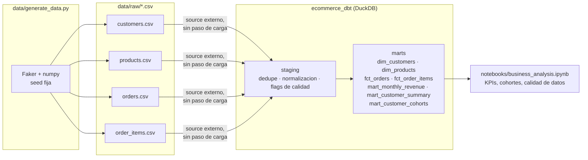

# Nortia Store — pipeline de datos end-to-end (SQL + dbt + Python)

Proyecto de portfolio: pipeline de datos completo para un e-commerce ficticio,
desde datos crudos con problemas de calidad reales hasta un modelo dimensional
documentado y testeado en dbt, con un notebook de analisis de negocio encima.

El objetivo no es solo "hacer un dashboard bonito": es demostrar el ciclo
completo que se espera de un analista/ingeniero de datos — ingesta, modelado,
tests de calidad, documentacion y analisis — sobre un caso con datos sucios
de verdad, no un CSV ya limpio de Kaggle.

## Arquitectura



Los CSV "crudos" se leen directamente desde DuckDB como `source` externo
(sin un paso previo de carga a tablas): es el patron nativo de `dbt-duckdb`
y evita depender de un warehouse cloud para un proyecto de portfolio.

## Por que tiene problemas de calidad a proposito

Los datos son sinteticos pero **no estan limpios**: el generador introduce a
proposito duplicados, nulos, formatos inconsistentes, referencias huerfanas y
outliers (ver `data/generate_data.py`), para que los tests de dbt y la capa
`staging` tengan un problema real que resolver en vez de limitarse a
`select * from tabla_ya_limpia`.

## Stack

- **DuckDB** como motor analitico (fichero local, cero infraestructura)
- **dbt-core + dbt-duckdb** para el modelado (staging → marts), tests y documentacion
- **Python** (Faker, pandas, numpy) para generar los datos crudos
- **Jupyter + matplotlib** para el analisis de negocio final

## Estructura del repo

```
.
├── data/
│   ├── generate_data.py      # genera los CSV crudos (con problemas de calidad)
│   └── raw/                  # customers, products, orders, order_items (CSV)
├── ecommerce_dbt/
│   ├── dbt_project.yml
│   ├── profiles.yml           # perfil local a DuckDB (sin credenciales)
│   ├── macros/                 # accepted_range y title_case (ver "Decisiones tecnicas")
│   ├── models/
│   │   ├── staging/            # 1 modelo por fuente: dedupe + normalizacion + flags
│   │   └── marts/               # dimensiones, hechos y marts analiticos
│   └── tests/                  # tests singulares (reconciliacion de ingresos, etc.)
├── notebooks/
│   └── business_analysis.ipynb # KPIs, cohortes de retencion, calidad de datos
├── scripts/
│   └── run_pipeline.sh         # ejecuta todo el pipeline de principio a fin
├── warehouse/                  # ecommerce.duckdb (se genera, no esta en git)
└── requirements.txt
```

## Como ejecutarlo

Requiere Python 3.10+.

```bash
git clone <tu-fork-de-este-repo>
cd ecommerce-dbt-pipeline
pip install -r requirements.txt
bash scripts/run_pipeline.sh
```

Esto genera los datos, corre `dbt build` (modelos + 32 tests de calidad) y
ejecuta el notebook de analisis de punta a punta. Todo el proceso tarda
menos de un minuto porque corre sobre un fichero DuckDB local.

Para explorar despues:

```bash
# documentacion interactiva de dbt (linaje, columnas, tests)
cd ecommerce_dbt && DBT_PROFILES_DIR=$(pwd) dbt docs serve

# abrir el notebook
jupyter notebook notebooks/business_analysis.ipynb

# consultar la base directamente
duckdb warehouse/ecommerce.duckdb
```

## Modelo de datos

**Staging** (`stg_customers`, `stg_products`, `stg_orders`, `stg_order_items`):
un modelo por fuente. Cada uno deduplica por clave primaria, normaliza texto
(pais, categoria, email) y **no descarta las filas problematicas**: las
conserva con un flag booleano explicito (`is_missing_email`,
`is_invalid_quantity`, `is_cost_corrected`...) y guarda el valor original en
una columna `_raw` cuando aplica, para que quede trazabilidad de que se
corrigio y por que.

**Marts**: `dim_customers` y `dim_products` son las dimensiones limpias.
`fct_order_items` es la tabla base (grano = una fila por linea de pedido):
incluye **todas** las lineas, pero solo calcula el importe
(`net_revenue`) cuando la linea es fiable (`is_valid_item = true`); si no,
el importe queda `null` en vez de arrastrar un numero inventado. A partir de
ahi, `fct_orders` agrega a nivel pedido y `mart_monthly_revenue`,
`mart_customer_summary` (RFM simplificado) y `mart_customer_cohorts`
(retencion por cohorte de alta) son los marts analiticos que consume el
notebook.

## Estrategia de tests: error vs. warning

El proyecto distingue dos tipos de problema, como haria un equipo de datos
en produccion:

- **Bloquean el build** (`error`): unicidad e integridad de claves primarias,
  rangos de ingreso (`net_revenue >= 0`), reconciliacion entre
  `fct_orders` y la suma de sus lineas — si esto falla, hay un bug real en
  la transformacion.
- **Se monitorizan sin bloquear** (`warn`): las relaciones de
  `fct_order_items` hacia `dim_customers`/`dim_products` estan en
  `severity: warn`, porque el ~0.3-0.4% de referencias huerfanas es una
  tasa de fondo esperable del sistema de origen (clientes/productos
  borrados despues de la compra), no un error de esta transformacion.

`dbt build` corre 32 tests: 30 pasan en verde y 2 avisan (warn) por diseno.

## Notebook de analisis

`notebooks/business_analysis.ipynb` responde con datos reales (del propio
pipeline, ya ejecutado y con las salidas guardadas en el notebook):
evolucion mensual del ingreso, reparto por categoria/canal, valor de vida
de cliente por segmento, retencion por cohorte de alta y un resumen de la
calidad de datos detectada. Tambien documenta honestamente una limitacion:
la curva de retencion sale plana porque el generador sintetico no modela
lealtad de cliente — se señala como limitacion del dataset, no como
hallazgo de negocio.

## Decisiones tecnicas (y limitaciones conocidas)

- **DuckDB en vez de un warehouse cloud**: cero infraestructura para clonar
  y correr el proyecto, manteniendo SQL identico al que se usaria en
  Snowflake/BigQuery/Postgres.
- **Sin `dbt_utils`**: el entorno donde se construyo este repo no tenia
  salida de red hacia `hub.getdbt.com`, asi que el test
  `accepted_range` (equivalente a `dbt_utils.accepted_range`) esta
  reimplementado como macro propia en `macros/generic_test_accepted_range.sql`.
  Si tu entorno si tiene acceso a internet, es igual de valido anadir
  `dbt-labs/dbt_utils` en `packages.yml` y usar la version del paquete.
- **`title_case` como macro propia**: DuckDB no trae una funcion `initcap()`
  nativa sin la extension `icu`; `macros/title_case.sql` la reimplementa con
  funciones de lista nativas de DuckDB.
- **Datos sinteticos, no un dataset real**: es una decision deliberada para
  que el proyecto sea 100% reproducible sin depender de una descarga externa,
  y para poder inyectar problemas de calidad de forma controlada y con
  intencion pedagogica.

## Posibles extensiones

- Anadir `dbt_utils` y `dbt-expectations` cuando se corra con acceso a red.
- Materializar `mart_monthly_revenue` como modelo incremental si el
  volumen creciera.
- Conectar `warehouse/ecommerce.duckdb` a Power BI/Tableau via su conector
  ODBC/JDBC de DuckDB para una capa de visualizacion adicional.
- Orquestar `scripts/run_pipeline.sh` con un scheduler (Airflow, Dagster o
  incluso un cron) si pasara a correr contra datos que cambian.

## Licencia

MIT — ver [`LICENSE`](LICENSE).
